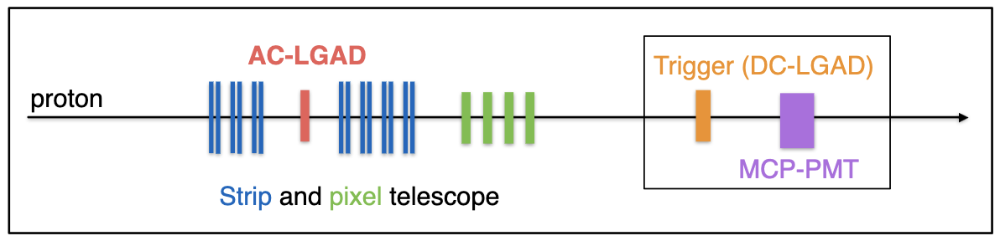
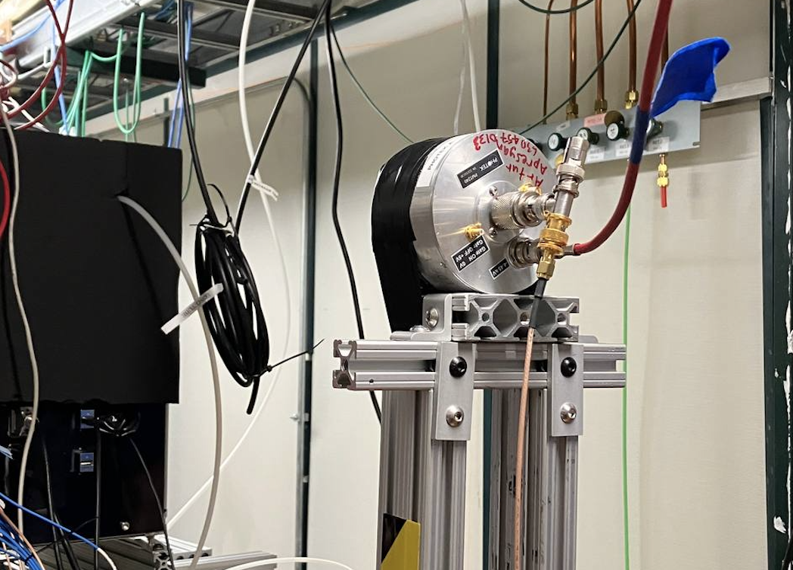

# Experimental chambers and data acquisition

Laser measurement performed at Fermilab provide a controlled environment that enables stable and reproducible measurements of the LGADs.
The sensors and read-out boards were mounted on aluminum cooling blocks, which were connected to a remotely operated motorized stage.
The cooling blocks were designed with a dense network of cooling channels to ensure efficient cooling of the mounted electronics.
A chilled glycol-water solution was circulated through the cooling blocks, capable of holding the sensors at a constant temperature ranging from −20 ◦C to 22 ◦C, as verified by on-board thermistors.
Direct contact with the cooling blocks was particularly crucial for the board, as it allowed for dissipation of significantly more heat than was possible by relying solely on contact with cold air. 
Various parameters related to the operation of the sensors were continuously monitored, such as the sensor temperature, bias voltage, leakage current, and air temperature and humidity. 
These values were synchronized with the waveform datastream offline. The temperature of the read-out boards was stable within -20 ◦C. The relative humidity of the environmental chamber was maintained at less than 10% through a constant flow of dry air.
<figure>

</figure>
For both the test beam and beta source measurements, a Photek 240 micro-channel plate (MCP-PMT) detector, placed inside the environmental chambers just behind the LGADs, provided a precise reference time stamp. Cherenkov radiation emitted by protons or beta particles passing through the glass window produced enough photoelectrons to generate a large and steeply rising MCP-PMT signal. The
Due to the lower intensity of Cherenkov radiation emitted by beta particles, the MCP-PMT signals in the beta setup had smaller amplitudes, resulting in a time resolution of approximately 15 ps.
The LGAD and MCP-PMT waveforms were acquired using a Keysight MSOX92004A 4-channel oscilloscope that provided digitized waveforms sampled at 20-40 GS/s, with bandwidth manually limited to 2 GHz.
<figure>

</figure>
