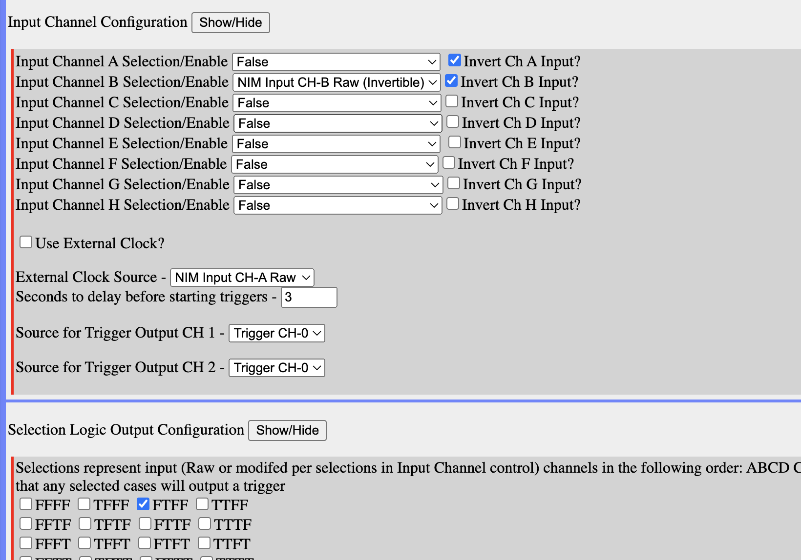
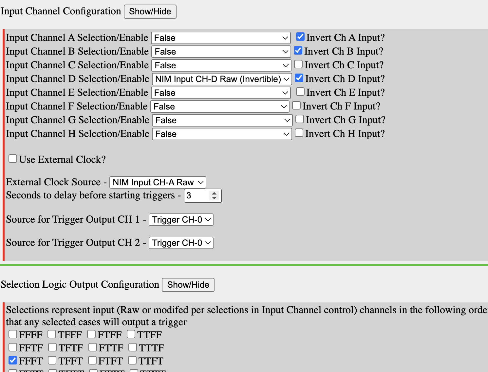
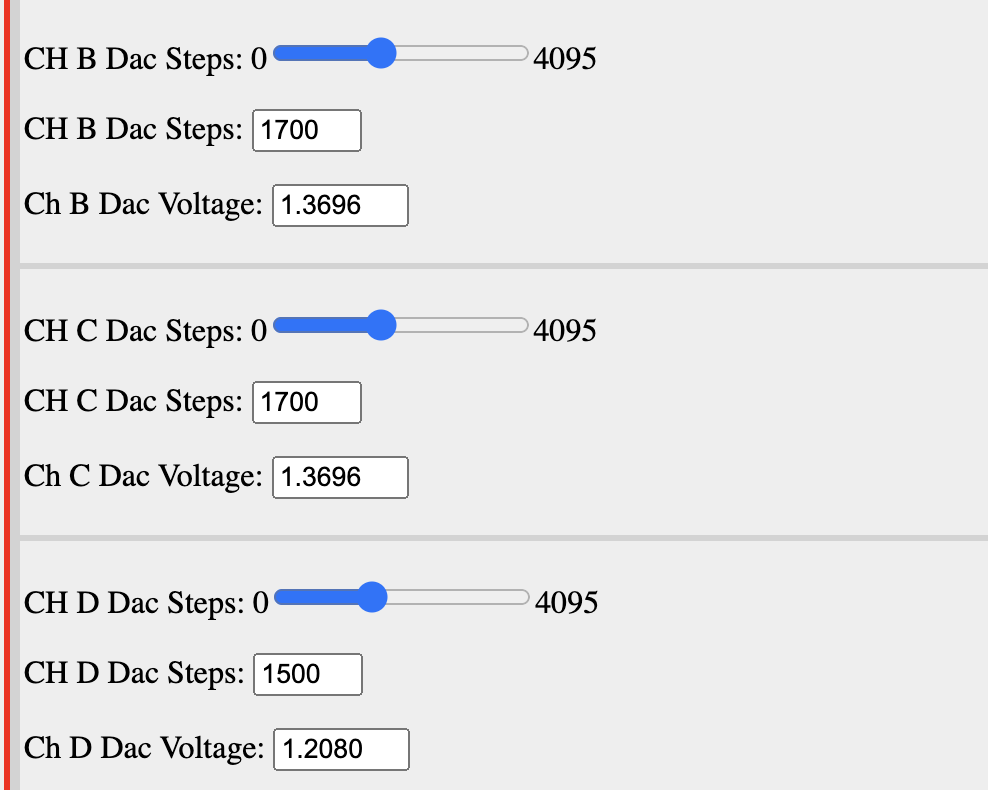

# Trigger NIM+ notes

State for default scintillator trigger:
NIM Plus:
<figure>

</figure>

<figure>

</figure>

Trying this:

<figure>

</figure>

<figure>

</figure>

Using 1700 for scintillator
Trying 1500 for NIM discriminator output>
