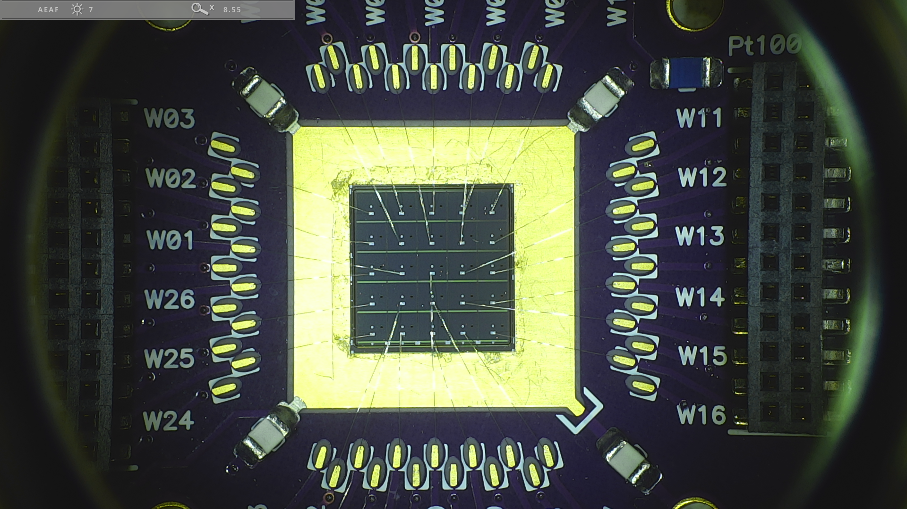
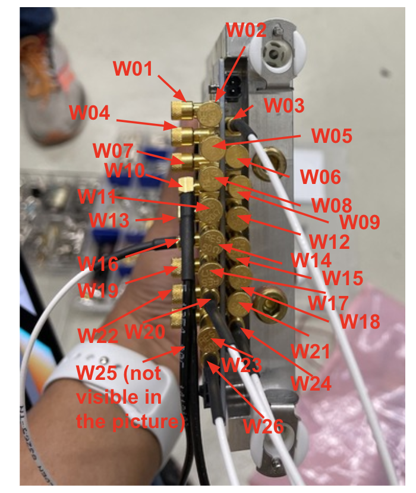

# Sensor connection Scheme for 5x5 FBK  on 26 channel board 

<figure>

</figure>

W03 (TL)  -> Scope Ch 1
W10 (TR) -> Scope CH2
W13 - CR -> Scope ch3
W16 (BR) -> Scope Ch 4
W24 (BL) -> Scope Ch5
W26 - CL -> Scope ch6
W20 (centre)-> Scope Ch7

<figure>

</figure>
