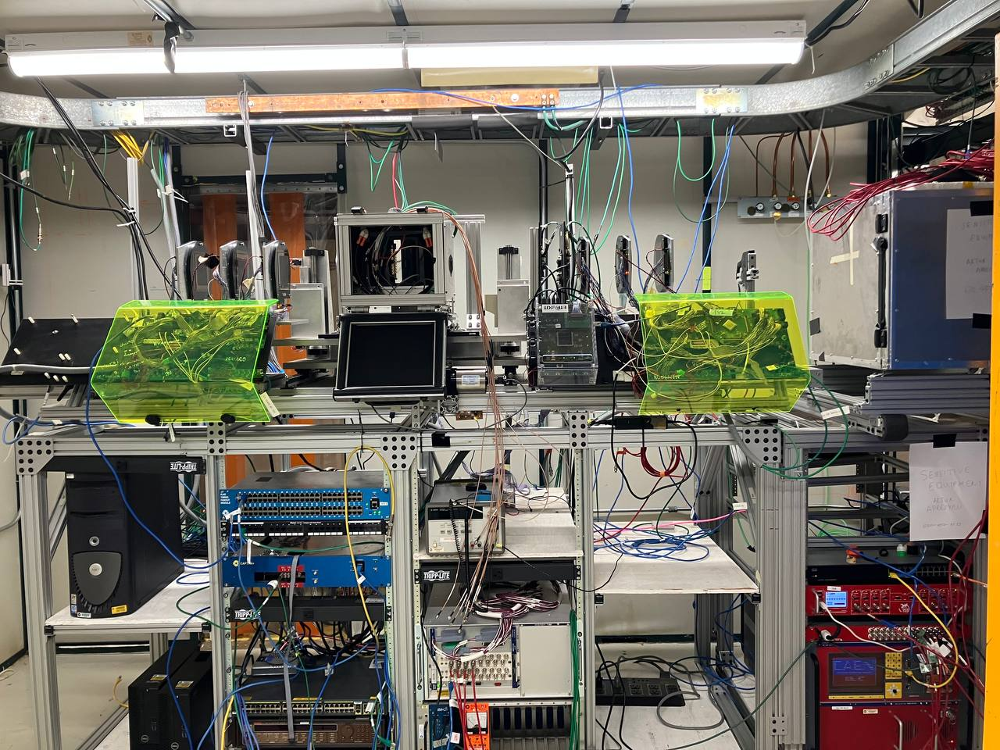

# Telescope geometry 

<figure>

</figure>

# Telescope software notes

OTSDAQ url (may change in future)
http://athenanu.dhcp.fnal.gov:2020/urn:xdaq-application:lid=200/#1000

ssh otsdaq@teddy01.dhcp.fnal.gov
Hyperscript is in ~/CMSTiming/HyperScript2023.sh

#Base data path is set in this script:
source /home/otsdaq/CMSTiming/Monicelli/setup2020i\_02\_February\_CMSTiming.sh

Uses Megascript: /home/otsdaq/CMSTiming/Megascript/Megascript\_NewMonicelli.py

This relies on Monicelli here:
/home/otsdaq/TestBeamTelescope/monicelli/
and Merger here:
/home/otsdaq/TestBeamTelescope/Merger/build/Merger

CMSTimingConverter lives in teddy /home/otsdaq/Tests/Monicelli/templates
called CMSTimingConverterApril2022

