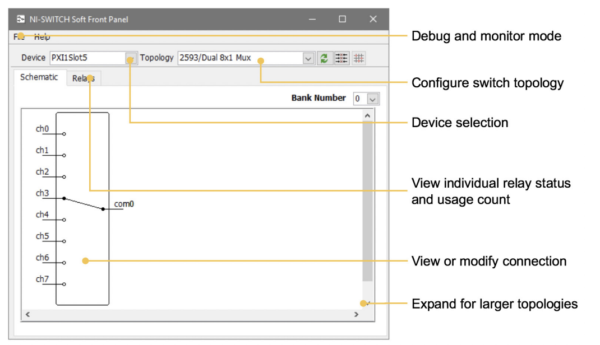

# Multiplexer software
 
 National Instruments - NI-SWITCH - CVI Examples

 Controlling an Individual Relay

 This example demonstrates how to control an individual relay on a switch module.

 Refer to the NI Switches Help for the valid relay names for your switch module.

 NI-SWITCH functions utilized:
```
 niSwitch_InitWithTopology
 niSwitch_RelayControl
 niSwitch_WaitForDebounce
 niSwitch_close


////
#include <stdio.h>
#include <stdlib.h>
////

#include "niswitch.h"
#include "niSwitchErrorHandler.h"

int getTotalLine(char *name)
void getChName(char *name,char *chname, char *ch)

int main (void)
{
  char fname[255];
  char Ch[3][6][255];
  char Chname[3][255];
void getChName(char *fname,char *Chname, char *ch)


   ViSession switchSession = VI_NULL;
   ViStatus switchError = VI_SUCCESS;

   for(int i=0;i<3;i++){
   ViRsrc resourceName = Chname[i];
	for(int j=0;j<6;j++);
	if(ch[i][j] == nulv)continue;

   ViConstString relayName = ch[i][j];//"b1r0c0"; //k1
   ViInt32 relayAction = NISWITCH_VAL_CLOSE_RELAY; //NISWITCH_VAL_OPEN_RELAY to open relay.
   ViConstString topology = NISWITCH_TOPOLOGY_CONFIGURED_TOPOLOGY;

   //Open a session to the switch module and set the topology.
   niSwitchCheckErr(niSwitch_InitWithTopology(
      resourceName,
      topology,
      VI_FALSE,
      VI_TRUE,
      &switchSession));

   //Open or Close the relay.
   niSwitchCheckErr(niSwitch_RelayControl(
      switchSession,
      relayName,
      relayAction));
   //Wait for the relay to activate and debounce.
   niSwitchCheckErr(niSwitch_WaitForDebounce(switchSession, 5000));

Error:

    if (switchError < VI_SUCCESS)
    {
       //Display errors (if any).
       niSwitch_ErrorHandler(switchSession, switchError);
    }
    if (switchSession != VI_NULL)
    {
       //Close the session to switch module.
       niSwitch_close(switchSession);
    }
}
}
    return 0;
}

int getTotalLine(char *name){
  FILE *fp;
  int line=0;
  char c;
  fp=fopen(name,"r");
  while((c=fgetc(fp))!=EOF)
    if(c=='\n') line++;
  fclose(fp);
  return(line);
}
void getChName(char *name,char *chname char *ch){
char *name = "ch.txt";
  FILE *fp;
  fp=fopen(name,"r");
  char ch[3][6][255];
  char chname[3][255];
  for(int i=0;i<3;i++){
     fscanf(fp,"%s", chname[i]);
        for(int j =0;j<6;j++){
          fscanf(fp,"%s", ch[i][j]);}
} 
   fclose(fp);
  for(int i=0;i<3;i++){
cout<<chname[i]<<endl;
        for(int j =0;j<6;j++){
cout<<ch[i][j]<<endl;
}
}
}
```


# NI-SWITCH Soft Front Panel

The NI-SWITCH driver software includes an interactive soft front panel for full out-of-the-box functionality. This interactive soft front panel allows you to configure the switch topology and change switch connections with a simple click. In addition, you can use the Debug Driver Session mode to monitor and
debug the switch during automated measurement. For example, you can monitor which signal paths are active, which individual relays are open/closed, and how many times each relay has been used. 

Download : https://www.ni.com/en-us/support/downloads/drivers/download.ni-switch.html

<figure>

</figure>
